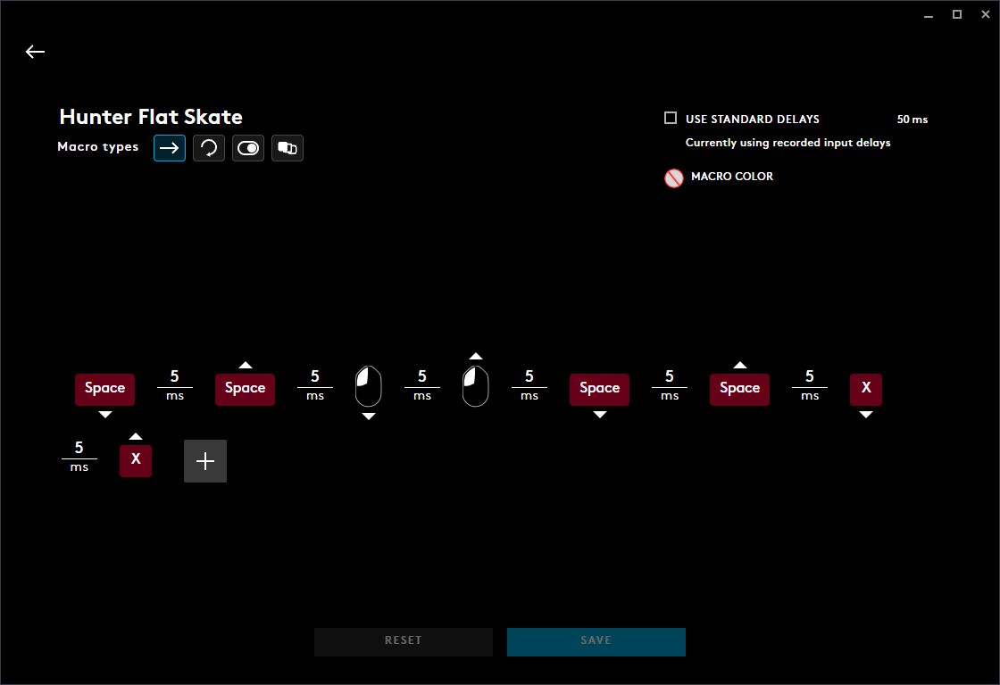
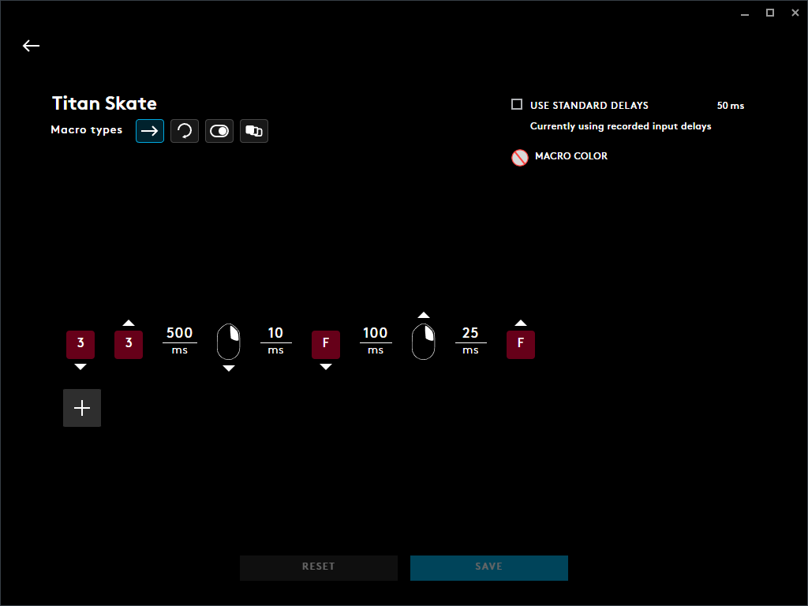
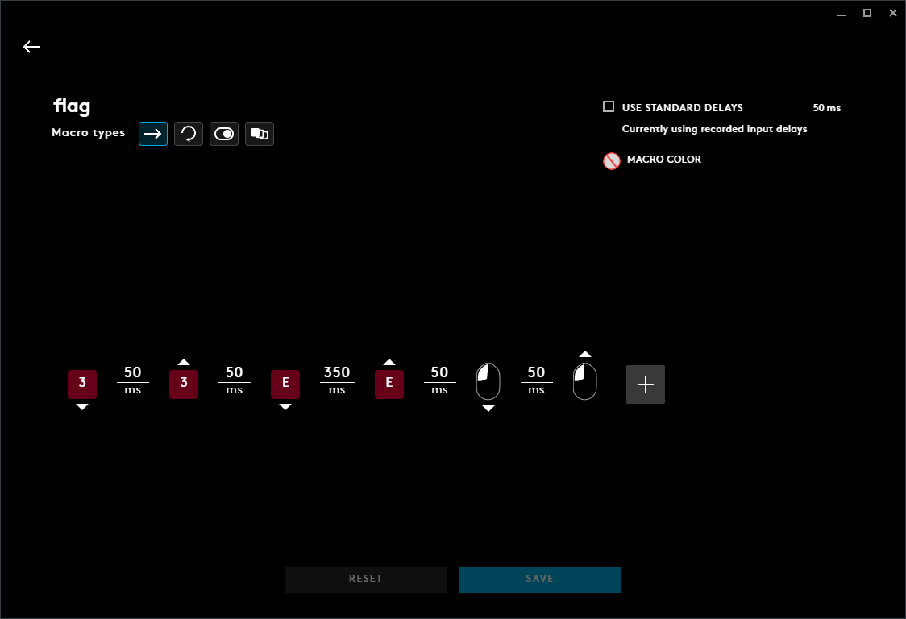
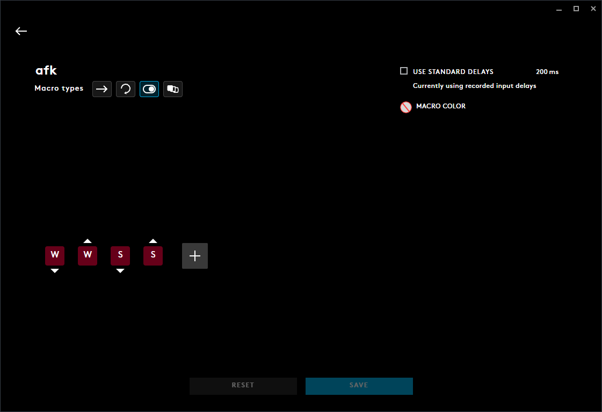

# Destiny 2

  ## Important
  **Yes these will work with any program that can make macros.**
  
  ## Table of Contents
  * [Hunter Skate](#Hunter-Skate)  
  * [Hunter Flat Skate](#Hunter-Flat-Skate)  
  * [Warlock Skate](#Warlock-Skate)  
  * [Warlock Flat Skate](#Warlock-Flat-Skate)  
  * [Titan Skate](#Titan-Skate)  
  * [Always On Time Sparrow Flying](#Always-On-Time-Sparrow-Flying)  
  * [Exotic Sparrow Flying](#Exotic-Sparrow-Flying)  
  * [Rally Flag Troll](#Rally-Flag-Troll)  
  * [AFK](#AFK)
  * [Lua Script Buttons](#Lua-Script-Buttons)
  * [Rocket Fly Lua Script](#Rocket-Fly-Lua-Script)
  * [Hunter Skate Lua Script](#Hunter-Skate-Lua-Script)
  * [Warlock Skate Lua Script](#Warlock-Skate-Lua-Script)

  ## Hunter Skate
  
  
  ## Hunter Flat Skate
  
  
  ## Warlock Skate
  
  
  ## Warlock Flat Skate
  
  
  ## Titan Skate
  
  
  ## Always On Time Sparrow Flying
  
  
  ## Exotic Sparrow Flying
  
  
  ## Rally Flag Troll
  
  
  ## AFK
  
  
  ## Lua Script Buttons
  Left Mouse Click = 1<br>
  Right Mouse Click = 2<br>
  Middle Mouse Click = 3<br>
  Bottom Side Button = 4<br>
  Top Side Button = 5<br>
  DPI = 6<br>
  Your GKeys might be different than mine - Logitech Mouse G203<br>
  ## Rocket Fly Lua Script
```
function OnEvent(event, arg)
if IsKeyLockOn("capslock") and (event == "MOUSE_BUTTON_PRESSED" and arg == 3) then
--                                                        Change if needed ^
PressAndReleaseMouseButton(1)
PressKey("q")
ReleaseKey("q")
MoveMouseRelative(0,30)
end
end
```

  ## Hunter Skate Lua Script
```
function OnEvent(event, arg)
if IsKeyLockOn("capslock") and (event == "MOUSE_BUTTON_PRESSED" and arg == 5) then
--                                                        Change if needed ^
PressMouseButton(3)
Sleep(35)
ReleaseMouseButton(3)
Sleep(35)
PressKey("spacebar")
Sleep(35)
ReleaseKey("spacebar")
Sleep(10)
PressKey("x") -- Shatter Dive Button. Change if needed
Sleep(10)
ReleaseKey("x") -- Shatter Dive Button. Change if needed
end
end
```
  
  ## Warlock Skate Lua Script
```
function OnEvent(event, arg)
if IsKeyLockOn("capslock") and (event == "MOUSE_BUTTON_PRESSED" and arg == 5) then
--                                                        Change if needed ^
PressMouseButton(3)
Sleep(35)
ReleaseMouseButton(3)
Sleep(35)
PressKey("spacebar")
Sleep(35)
ReleaseKey("spacebar")
Sleep(35)
PressKey("f") -- Super Button. Change if needed
Sleep(35)
ReleaseKey("f") -- Super Button. Change if needed
end
end
```