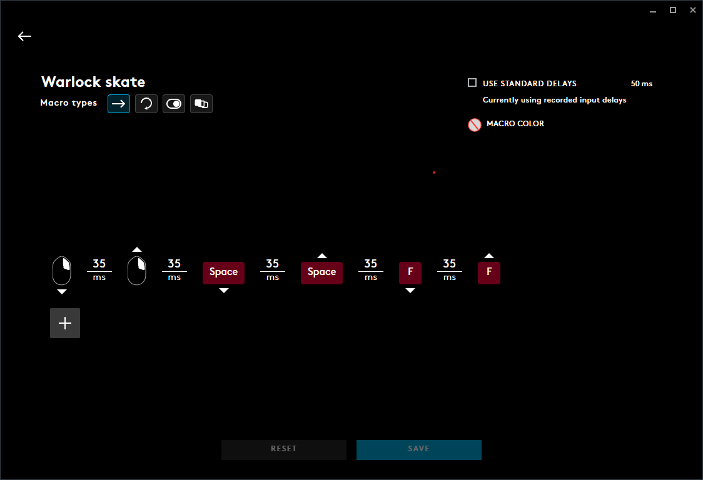

# Destiny 2 Macros

  ## Important
  **Yes these will work with any program that can make macros. AutoHotKey, Razer, Tinytask, etc**
  
  ## Table of Contents
  * [Hunter Skate](#hunter-skate)
  * [Hunter Flat Skate](#hunter-flat-skate)
  * [Warlock Skate](#warlock-skate)
  * [Warlock Flat Skate](#warlock-flat-skate)
  * [Titan Skate](#titan-skate)
  * [Always On Time Sparrow Flying](#always-on-time-sparrow-flying)
  * [Exotic Sparrow Flying](#exotic-sparrow-flying)
  * [Rally Flag Troll](#rally-flag-troll)
  * [AFK](#afk)
  * [Lua Script Buttons](#lua-script-buttons)
  * [Rocket Fly Lua Script](#rocket-fly-lua-script)
  * [Hunter Skate Lua Script](#hunter-skate-lua-script)
  * [Warlock Skate Lua Script](#warlock-skate-lua-script)

  ## Hunter Skate
  
  Usage: [Link Here](https://youtu.be/1JK1tbOjQcI)
  
  ## Hunter Flat Skate
  
  Usage: [Link Here](https://youtu.be/dxexie6Hg1M)
  
  ## Warlock Skate
  
  Usage: [Link Here](https://youtu.be/a6Cv_LOeTMc)
  
  ## Warlock Flat Skate
  
  Usage: [meow](https://youtu.be/8dBiK6m_uzI)
  
  ## Titan Skate
  
  Usage: [Link Here]()
  
  ## Always On Time Sparrow Flying
  
  Usage: [Link Here]()
  
  ## Exotic Sparrow Flying
  
  Usage: [Link Here]()
  
  ## Rally Flag Troll
  
  Usage: [Link Here]()
  
  ## AFK
  
  Usage: [Link Here]()
  
  ## Lua Script Buttons
  Left Mouse Click = 1<br>
  Right Mouse Click = 2<br>
  Middle Mouse Click = 3<br>
  Bottom Side Button = 4<br>
  Top Side Button = 5<br>
  DPI = 6<br>
  Your GKeys might be different than mine - Logitech Mouse G203<br>
  ## Rocket Fly Lua Script
```
function OnEvent(event, arg)
if IsKeyLockOn("capslock") and (event == "MOUSE_BUTTON_PRESSED" and arg == 3) then
--                                                        Change if needed ^
PressAndReleaseMouseButton(1)
PressKey("q")
ReleaseKey("q")
MoveMouseRelative(0,30)
end
end
```

  ## Hunter Skate Lua Script
```
function OnEvent(event, arg)
if IsKeyLockOn("capslock") and (event == "MOUSE_BUTTON_PRESSED" and arg == 5) then
--                                                        Change if needed ^
PressMouseButton(3)
Sleep(35)
ReleaseMouseButton(3)
Sleep(35)
PressKey("spacebar")
Sleep(35)
ReleaseKey("spacebar")
Sleep(10)
PressKey("x") -- Shatter Dive Button. Change if needed
Sleep(10)
ReleaseKey("x") -- Shatter Dive Button. Change if needed
end
end
```
  
  ## Warlock Skate Lua Script
```
function OnEvent(event, arg)
if IsKeyLockOn("capslock") and (event == "MOUSE_BUTTON_PRESSED" and arg == 5) then
--                                                        Change if needed ^
PressMouseButton(3)
Sleep(35)
ReleaseMouseButton(3)
Sleep(35)
PressKey("spacebar")
Sleep(35)
ReleaseKey("spacebar")
Sleep(35)
PressKey("f") -- Super Button. Change if needed
Sleep(35)
ReleaseKey("f") -- Super Button. Change if needed
end
end
```
